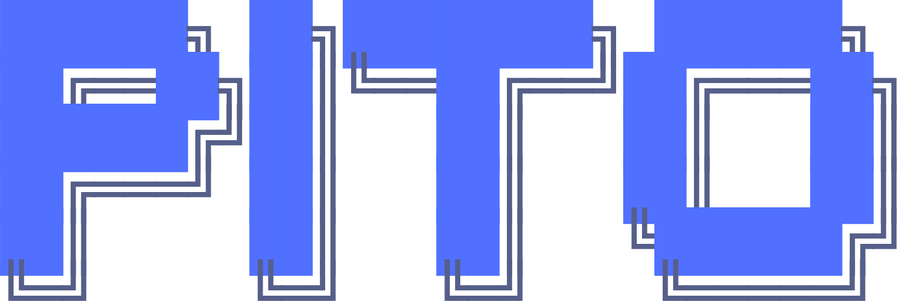
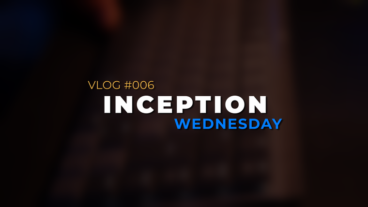
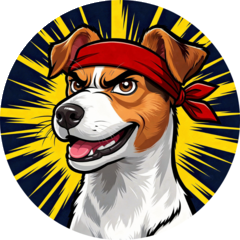
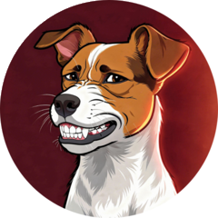
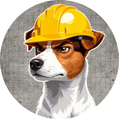
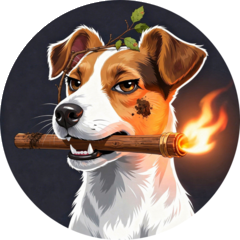

# pitomd

[](https://github.com/gmrdad82/pitomd/actions/workflows/ci.yml)
[](https://github.com/gmrdad82/pitomd/actions/workflows/deploy.yml)
[](https://www.gnu.org/licenses/agpl-3.0)
[](https://github.com/sponsors/gmrdad82)

<!-- prettier-ignore -->
<p align="center"><a href="https://pitomd.com"></a></p>

Source for **[pitomd.com](https://pitomd.com)** — the over-the-top, scroll-driven
landing page for **[PITO](https://github.com/gmrdad82/pito)**, the self-hosted YouTube
tool for multi-channel creators. This repo is the _marketing surface_; PITO itself
lives next door.

---

## 1 · This repo — the showcase

`pitomd` is one long, glamorous scroll. It doesn't document PITO — it **sells** it.
Each section re-themes itself (all 19 of PITO's editor palettes), big display type
carries the message, and the terminal fx — typewriter, scramble, comet, cursor-trail —
are reimagined as scroll-triggered spectacle. There's a pinned **Voyage AI**
scrollytelling beat, a masonry wall of real game covers, magnetic buttons, and a
colour-flood transition between frames. Spectacle in the framing, clarity in the
message.

**Stack:** [Astro](https://astro.build) (static output) + CSS-first scroll animations +
tiny vanilla-JS islands — no framework, no SSR, no tracking. Built to `dist/` and
served by **Cloudflare Pages**. The whole thing is one HTML document plus a handful of
small scripts.

> The site _borrows_ PITO's palette (`#5170ff` pito-blue, the 19 themes) and texture as
> ingredients — it is not a copy of the app. Tokens and assets are referenced from the
> PITO repo, never imported at build time.

---

## 2 · What it's selling — PITO

<!-- prettier-ignore -->
<p align="center"><a href="https://www.youtube.com/@gmrdad82"></a></p>
<p align="center"><em>▶ A guided tour of PITO — on <a href="https://www.youtube.com/@gmrdad82">@gmrdad82</a>.</em></p>

**One chatbox. Every channel.** YouTube Studio manages exactly one channel at a time —
log out, log in, repeat until your will to live quietly files for unemployment. The
paid tools (Social Blade, vidIQ, TubeBuddy) wanted €50+ a month and still didn't fit.
So PITO got built: a self-hosted command deck where you type plain English and it
answers — across every channel at once.

- **Plain language** — `list vids`, `show game 42`, `list games rpg ps5`.
- **Smart linkage** — games ↔ videos ↔ channels, with **Voyage AI** embeddings
  surfacing what to play next and which channel a game fits.
- **Footage, price, scores** — track recorded hours, what you paid to acquire a game,
  and vote-weighted scores, all in one card.
- **Scheduling** across channels, **19 themes**, **achievements** ("shinies").
- **€0, self-hosted, AGPL** — your laptop, your data, nothing phones home.

It's a one-line install (`curl … | sh`) and the full story — features, install,
operating, API keys — lives in PITO's own README:

👉 **[github.com/gmrdad82/pito](https://github.com/gmrdad82/pito)** · 🌐 **[pitomd.com](https://pitomd.com)**

### Sponsor PITO

PITO is free, AGPL, and costs nothing to give away — but it costs _time_. If it saves
you the €50-a-month the others wanted, you can point a fraction of that back at keeping
it alive and growing, through **GitHub Sponsors**:

👉 **[github.com/sponsors/gmrdad82](https://github.com/sponsors/gmrdad82)**

How it works: pick a tier — a few euros a month, or a one-time tip — and that's it.
GitHub takes **0%** and covers payment processing, so what you pledge is what lands.
There's no paywall and never will be; sponsoring buys you exactly **nothing extra**
except my genuine gratitude and the quiet satisfaction of keeping an indie tool indie.

---

## 3 · Back to this repo — develop & deploy

```bash
bin/dev          # installs deps on first run, serves http://localhost:4321
npm run dev      # same, without the wrapper
npm run build    # → dist/
npm run preview  # serve the built dist/
npm run lint     # prettier --check . + eslint + stylelint
npm run format   # prettier --write .
npx astro check  # type + template check
```

**Layout:** `src/pages/index.astro` is the single page; `src/components/` holds
`Section.astro` (theme-per-section) + `ColorBridge.astro` + `PitoLogo.astro`;
`src/scripts/` are the vanilla fx islands; `src/styles/` is the token layer + the 19
`[data-theme]` blocks. Agent/contributor notes live in [`CLAUDE.md`](CLAUDE.md).

**CI / deploy** (GitHub Actions):

- **Website CI** — `npm audit`, prettier, eslint, stylelint, `astro check`, build, and
  a Lighthouse pass (a11y / SEO / best-practices gated; performance a warning).
- **Deploy** — builds and publishes `dist/` to Cloudflare Pages on every push to
  `main`. A Slack "Deadpan Butler" posts at most one message per push: a deploy notice
  on success, or a single failure note (no spam).

### Find me / the channels

The gaming side is the **Gamer Dad** / Manfy network — the channels that dragged PITO
into existence:

<!-- prettier-ignore -->
<p align="center"><a href="https://www.youtube.com/@gmrdad82"></a> <a href="https://www.youtube.com/@gmrdad82fighter"></a> <a href="https://www.youtube.com/@gmrdad82good"></a> <a href="https://www.youtube.com/@gmrdad82hard"></a> <a href="https://www.youtube.com/@gmrdad82strategist"></a> <a href="https://www.youtube.com/@gmrdad82survivor"></a></p>

- ▶ **YouTube** — [@gmrdad82](https://www.youtube.com/@gmrdad82) (engineering/personal,
  where PITO gets its tour)
- 💬 **Discord** — [discord.gg/q947UyDTqJ](https://discord.gg/q947UyDTqJ)
- ✖ **X** — [@GamerDady82](https://x.com/GamerDady82)

## License

[AGPL-3.0](LICENSE). Fork it, learn from it, build on it — just don't pass it off as
your own. No warranty, as-is. Questions? Ping me: gmrdad82 [at] gmail [dot] com.
