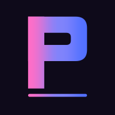
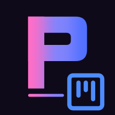
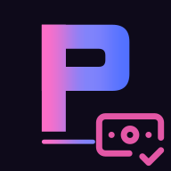
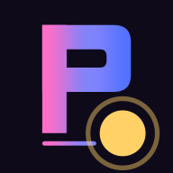
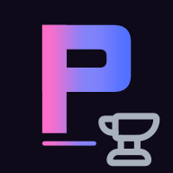
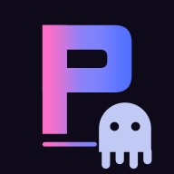
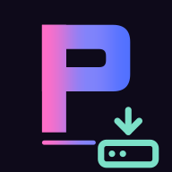
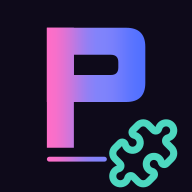
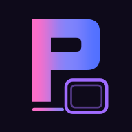

<p align="center">&nbsp;&nbsp;&nbsp;&nbsp;&nbsp;&nbsp;&nbsp;&nbsp;&nbsp;&nbsp;</p>

# pitomd

[](https://github.com/gmrdad82/pitomd/actions/workflows/ci.yml)
[](https://github.com/gmrdad82/pitomd/actions/workflows/deploy.yml)
[](https://www.gnu.org/licenses/agpl-3.0)

<!-- prettier-ignore -->
<p align="center"><a href="https://pitomd.com"></a></p>

Source for **[pitomd.com](https://pitomd.com)** — the marketing surface for
**[Pito](https://github.com/gmrdad82/pito)**, the self-hosted YouTube tool for
multi-channel creators. This repo is the marketing surface; Pito itself lives
next door.

**Two live pages (GOAL-1 estate freeze).** `pitomd.com` is now a countdown
teaser — a number that ticks and makes no sense, growing a digit longer every
time you touch it, over a living sky-and-butterfly-flock background — with a
small banner pointing at the free chat. The chat showcase that used to live at
`/` moved to **[pitomd.com/chat](https://pitomd.com/chat)**, with its own
banner back to `/`. Pito Studio's own showcase (`/studio`) is **parked**
in-repo (`src/parked/studio.astro`, unrouted) until it actually ships — no
page links it right now.

---

## 1 · This repo — the showcase

`pitomd` is one long, glamorous scroll at `/chat`. It doesn't document Pito — it **sells** it.
Each section re-themes itself (all 19 of Pito's editor palettes), big display type
carries the message, and the terminal fx — typewriter, scramble, comet, cursor-trail —
are reimagined as scroll-triggered spectacle. There's a pinned **local-AI**
scrollytelling beat — _"It runs on your box."_ A 300M-parameter embedding model
ships inside the stack, no API key, no bill — plus a masonry wall of real game
covers, magnetic buttons, and a colour-flood transition between frames.
Spectacle in the framing, clarity in the message.

**Stack:** [Astro](https://astro.build) (static output) + CSS-first scroll animations +
tiny vanilla-JS islands — no framework, no SSR, no tracking. Built to `dist/` and
served by **Cloudflare Pages**. The whole thing is one HTML document plus a handful of
small scripts.

> The site _borrows_ Pito's palette (`#5170ff` pito-blue, the 19 themes) and texture as
> ingredients — it is not a copy of the app. Tokens and assets are referenced from the
> Pito repo, never imported at build time.

---

## 2 · What it's selling — Pito

<!-- prettier-ignore -->
<p align="center"><a href="https://youtu.be/7y3R403XtDE"></a></p>
<p align="center"><em>▶ A guided tour of Pito — <a href="https://youtu.be/7y3R403XtDE">watch the tour</a>, on <a href="https://www.youtube.com/@gmrdad82">@gmrdad82</a>.</em></p>

**One chatbox. Every channel.** YouTube Studio manages exactly one channel at a time —
log out, log in, repeat until your will to live quietly files for unemployment. The
paid tools (Social Blade, vidIQ, TubeBuddy) wanted €50+ a month and still didn't fit.
So Pito got built: a self-hosted command deck where you type plain English and it
answers — across every channel at once.

- **Plain language** — `list vids`, `show game 42`, `list games rpg ps5`.
- **Smart linkage** — games ↔ videos ↔ channels, with a built-in **local embedder**
  surfacing what to play next and which channel a game fits, right after import —
  Pito suggests, you confirm.
- **Footage, price, scores** — track recorded hours, what you paid to acquire a game,
  and vote-weighted scores, all in one card.
- **Scheduling** across channels and **achievements** ("shinies").
- **€0, self-hosted, AGPL** — your laptop, your data, nothing phones home.

It's a one-line install (`curl … | sh`) and the full story — features, install,
operating, API keys — lives in Pito's own README:

👉 **[github.com/gmrdad82/pito](https://github.com/gmrdad82/pito)** · 🌐 **[pitomd.com](https://pitomd.com)**

---

## 3 · Back to this repo — develop & deploy

```bash
bin/dev          # installs deps on first run, serves http://localhost:4321
npm run dev      # same, without the wrapper
npm run build    # → dist/
npm run preview  # serve the built dist/
npm run lint     # prettier --check . + eslint + stylelint
npm run format   # prettier --write .
npx astro check  # type + template check
```

**Layout:** `src/pages/index.astro` is the countdown teaser (`/`);
`src/pages/chat.astro` is the chat showcase (`/chat`); `src/parked/` holds
`studio.astro`, unrouted until Pito Studio ships. `src/components/` holds
`Section.astro` (theme-per-section) + `ColorBridge.astro` + `PitoLogo.astro` +
`CrossNav.astro` (the way-back pill both live routes mount);
`src/scripts/` are the vanilla fx islands; `src/styles/` is the token layer + the 19
`[data-theme]` blocks. Agent/contributor notes live in [`CLAUDE.md`](CLAUDE.md).

**CI / deploy** (GitHub Actions):

- **Website CI** — `npm audit`, prettier, eslint, stylelint, `astro check`, build, and
  a Lighthouse pass (a11y / SEO / best-practices gated; performance a warning).
- **Deploy** — builds and publishes `dist/` to Cloudflare Pages on every push to
  `main`. A Slack "Deadpan Butler" posts at most one message per push: a deploy notice
  on success, or a single failure note (no spam).

### Find me

**Gamer Dad - Stories** is the channel that dragged Pito into existence:

<!-- prettier-ignore -->
<p align="center"><a href="https://www.youtube.com/@gmrdad82"></a></p>

Stuck, lost, or just want to report that the cover art _finally_ loaded? There's a
Discord — pop in, ask away, judgment kept to a minimum
👉 **[discord.gg/q947UyDTqJ](https://discord.gg/q947UyDTqJ)**

Prefer elsewhere? Find me on X 👉 **[@GamerDady82](https://x.com/GamerDady82)**, or on
YouTube at **[@gmrdad82](https://www.youtube.com/@gmrdad82)** — Gamer Dad - Stories,
where Pito gets its tour.

No SLA, no ticket queue, no "your call is important to us." Just a channel and a human
who checks it between renders.

## License

[AGPL-3.0](LICENSE). Fork it, learn from it, build on it — just don't pass it off as
your own. No warranty, as-is. Questions? Ping me: gmrdad82 [at] gmail [dot] com.
